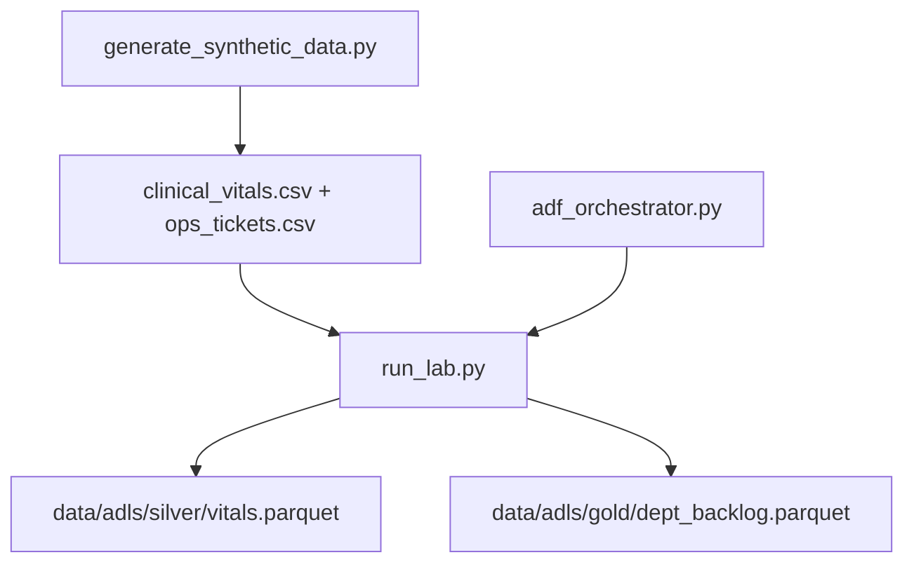

# Azure Health Data Platform Lab (Local Simulation, Synthetic)

**Author:** Faiz Elahi · **Type:** EDUCATIONAL PORTFOLIO LAB · **SYNTHETIC DATA ONLY**

---

## Educational disclaimer / synthetic data

This lab **simulates** Azure Data Lake Storage medallion folders, DuckDB transforms, and an ADF-style orchestrator on **synthetic clinical vitals and ops tickets**. It does **not** provision Azure subscriptions, Data Factory pipelines, or FHIR services. No real patient data.

Use honest language: *“I ran a local medallion transform and ADF-style activity chain on synthetic healthcare ops CSVs.”*

---

## Problem statement (detailed)

Health platforms on Azure often combine **clinical observations** and **operational workloads** (tickets, backlog) in a medallion architecture:

- **Bronze** — Raw CSV landing in ADLS-like paths
- **Silver** — Cleaned, typed vitals with null handling
- **Gold** — Department-level KPIs for service lines

Students need to see **`run_lab.py`** build tables in `azure_lab.duckdb`, export **`vitals.parquet`** and **`dept_backlog.parquet`**, and optionally chain activities via **`adf_orchestrator.py`** without cloud credentials.

---

## Why this tool

| Azure portal clicking | This lab pipeline |
|-----------------------|-------------------|
| Hidden transform SQL | Explicit DuckDB DDL in `run_lab.py` |
| Cost surprises | Local Parquet under `data/adls/` |
| Siloed tutorials | Clinical + ops in one flow |

Pairs with **`hl7-fhir-interop-lab`** and **`gcp-healthcare-api-concepts-lab`**.

---

## Architecture



See [`docs/architecture.md`](docs/architecture.md).

---

## Dataset dictionary (tables / columns)

| File | Grain | Key columns | Notes |
|------|-------|-------------|-------|
| `clinical_vitals.csv` | Observation | `observation_id`, `patient_id`, `loinc`, `value`, `unit`, `taken_at` | Bronze vitals |
| `ops_tickets.csv` | Ticket | `ticket_id`, `department`, `minutes_open`, `priority`, `opened_at` | Ops backlog source |
| `adls/silver/vitals.parquet` | Observation | Filtered non-null `value` | Silver export |
| `adls/gold/dept_backlog.parquet` | Department | `avg_minutes`, `tickets` | Gold KPI table |
| `azure_lab.duckdb` | Database file | DuckDB tables | Created on run |

---

## Prerequisites

- Python 3.10+
- `duckdb` (see `requirements.txt`)

---

## Step-by-step: how to run

### Windows PowerShell

```powershell
cd azure-health-data-platform-lab
python -m venv .venv
.\.venv\Scripts\Activate.ps1
pip install -r requirements.txt
python scripts/generate_synthetic_data.py
python -m src.run_lab
python -m src.adf_orchestrator
python scripts/generate_charts.py
```

### Optional bash

```bash
cd azure-health-data-platform-lab
python3 -m venv .venv && source .venv/bin/activate
pip install -r requirements.txt
python scripts/generate_synthetic_data.py
python -m src.run_lab
python -m src.adf_orchestrator
python scripts/generate_charts.py
```

---

## File-by-file walkthrough

| Path | Role |
|------|------|
| `scripts/generate_synthetic_data.py` | Synthetic vitals and tickets |
| `src/run_lab.py` | Bronze load, silver/gold SQL, Parquet export, prints gold backlog |
| `src/adf_orchestrator.py` | Logs ordered activities; invokes `run_lab` |
| `scripts/generate_charts.py` | Charts under `docs/images/` |
| `docs/architecture.md` | Azure service name mapping |

---

## Expected outputs and how to interpret them

- Console **`gold_dept_backlog`** — Average minutes open and ticket counts by department.
- **Parquet files** under `data/adls/silver/` and `data/adls/gold/`.
- **`azure_lab.duckdb`** — Inspect with DuckDB CLI for silver/gold tables.
- Orchestrator log lines labeled **ADF-style** for interview storytelling only.

---

## Results interpretation

- **Silver filter** removes null vitals— discuss imputation vs drop in real pipelines.
- **Ticket backlog** is operational, not clinical quality—keep KPI audiences separate.
- Synthetic departments have **no real hospital mapping**.

---

## Glossary (8+ terms)

1. **ADLS** — Azure Data Lake Storage; simulated folder tree here.
2. **Medallion** — Bronze / silver / gold layering pattern.
3. **Azure Data Factory** — Orchestration service; `adf_orchestrator.py` is a metaphor.
4. **LOINC** — Lab observation code on vitals rows.
5. **Silver layer** — Cleaned, conformed data ready for modeling.
6. **Gold layer** — Business-level aggregates for BI.
7. **Ops ticket** — IT or facilities workflow record (synthetic).
8. **Parquet** — Columnar export format used for silver/gold.
9. **DuckDB** — Local analytical engine standing in for Synapse/SQL pool demos.

---

## Common mistakes (5+)

1. Stating you **deployed Azure Data Factory** from this repository alone.
2. Mixing **clinical vitals** KPIs with **ticket backlog** on one clinical safety dashboard.
3. Ignoring **timezone** on `taken_at` and `opened_at` in real designs.
4. Skipping **PHI zoning** (separate subscriptions/VNets) in architecture interviews.
5. Treating **gold averages** as SLA commitments.
6. Deleting **`azure_lab.duckdb`** mid-demo without rerunning transforms.

---

## Exercises (5+)

1. Add **priority-weighted backlog** score in gold SQL.
2. Implement **slowly changing dimension** for department renames (conceptual table).
3. Extend orchestrator with a **failure injection** activity and retry log.
4. Map **`clinical_vitals.csv`** fields to FHIR Observation (see **`gcp-healthcare-api-concepts-lab`**).
5. Document **Private Link** design for ADLS in a one-page architecture note.
6. Compare this flow to **`databricks-lakehouse-medallion-lab`** Delta semantics.

---

## Limitations / simulation vs production

- No Azure Synapse, Fabric, or Health Data Services APIs.
- Local filesystem paths—not ABFS URLs with OAuth.
- Synthetic vitals—not for clinical decision support.
- Educational code—**not HIPAA cloud reference architecture**.

---

## Related labs

- [`gcp-healthcare-api-concepts-lab`](../gcp-healthcare-api-concepts-lab/) — FHIR resource modeling.
- [`hl7-fhir-interop-lab`](../hl7-fhir-interop-lab/) — Interop patterns.
- [`terraform-multicloud-landing-zone-lab`](../terraform-multicloud-landing-zone-lab/) — Multicloud IaC.

---

**Author:** Faiz Elahi · Educational portfolio use.
